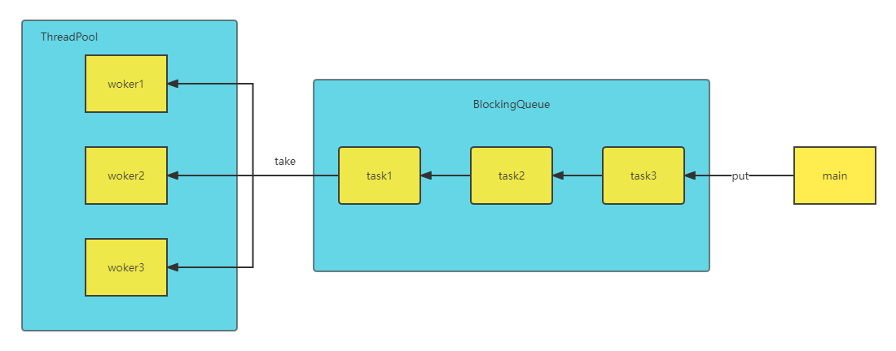

# CustomThreadPool

## 一、 自定义线程池框架图



## 二、 阻塞任务队列

* 任务队列底层通过双向队列实现，基于生产消费者的设计模式，应用ReeentrantLock进行队列的线程安全保护

```java
public class BlockingQueue<T> {
    // 任务队列容量
    private int capacity;
    // 任务队列
    private Deque<T> queue = new ArrayDeque<>();
    // 锁
    private ReentrantLock lock = new ReentrantLock();
    // 消费者条件变量
    private Condition emptyWaitCondition = lock.newCondition();
    // 生产者条件变量
    private Condition fullWaitCondition = lock.newCondition();
    // 构造方法
    public BlockingQueue(int capacity) {
        this.capacity = capacity;
    }
    ...
}
```


### 1.  线程安全保护

* 每当线程在操作阻塞任务队列的时候，都需要对其上锁，即调用ReeentrantLock的lock方法，同样，在每次操作结束的时候都需要在finally的代码块中释放锁，即调用ReeentrantLock的unlock方法。

* 通过ReeentrantLock设置两个Condition，一个用于代表消费者条件变量emptyWaitCondition，另一个用于代表生产者条件变量fullWaitCondition。
  * 当任务队列为空时，无法从任务队列中获取task，需要调用emptyWaitCondition的await方法进行阻塞。
    * 当其它线程成功将task加入任务队列时需要调用emptyWaitCondition的signal方法进行唤醒。
  * 当任务队列满时，无法将新的任务加入任务队列，需要调用fullWaitCondition的await方法进行阻塞。
    * 当其它线程成功从任务队列中获取task时，需要调用fullWaitCondition的signal方法进行唤醒。

```java
    // 阻塞获取
    public T take() {
        lock.lock();
        try {
            while (queue.isEmpty()) {
                try {
                    log.debug("任务队列已空，等待获取任务...");
                    emptyWaitCondition.await();
                } catch (InterruptedException e) {
                    e.printStackTrace();
                }
            }
            log.debug("获取任务...");
            T t = queue.removeFirst();
            fullWaitCondition.signal();
            return t;
        } finally {
            lock.unlock();
        }
    }
    
    // 阻塞添加
    public void put(T task) {
        lock.lock();
        try {
            while (queue.size() == capacity) {
                try {
                    log.debug("任务队列已满，等待加入任务队列{}...", task);
                    fullWaitCondition.await();
                } catch (InterruptedException e) {
                    e.printStackTrace();
                }
            }
            log.debug("加入任务队列{}...", task);
            queue.addLast(task);
            emptyWaitCondition.signal();
        } finally {
            lock.unlock();
        }
    }
```


### 2.  超时等待及拒绝策略

* 在执行任务队列的添加和获取造作时，可以基于awaitNanos方法来设定等待时间
* 在设计将task加入任务队列的方法时，可以通过实现RejectPolicy接口来保证拒绝策略的可拓展性

```java
    // 带超时阻塞获取
    public T tryTake(long timeout, TimeUnit timeUnit) {
        lock.lock();
        try {
            long nanos = timeUnit.toNanos(timeout);
            while (queue.isEmpty()) {
                try {
                    if (nanos <= 0) {
                        log.debug("等待获取超时...");
                        return null;
                    }
                    log.debug("任务队列已空，超时等待获取任务...");
                    nanos = emptyWaitCondition.awaitNanos(nanos);
                } catch (InterruptedException e) {
                    e.printStackTrace();
                }
            }
            log.debug("获取任务...");
            T t = queue.removeFirst();
            fullWaitCondition.signal();
            return t;
        } finally {
            lock.unlock();
        }
    }
    
        // 带超阻塞添加
    public boolean tryPut(T task, long timeout, TimeUnit timeUnit) {
        lock.lock();
        try {
            long nanos = timeUnit.toNanos(timeout);
            while (queue.size() == capacity) {
                try {
                    if (nanos <= 0) return false;
                    nanos = fullWaitCondition.awaitNanos(nanos);
                    log.debug("任务队列已满,超时等待加入任务队列{}...", task);
                } catch (InterruptedException e) {
                    e.printStackTrace();
                }
            }
            log.debug("加入任务队列{}...", task);
            queue.addLast(task);
            emptyWaitCondition.signal();
            return true;
        } finally {
            lock.unlock();
        }
    }

    // 添加(拒绝策略)
    public void rejectTryPut(T task, RejectPolicy<T> rejectPolicy) {
        lock.lock();
        try {
            if (queue.size() == capacity) {
                rejectPolicy.reject(this, task);
            } else {
                log.debug("加入任务队列{}...", task);
                queue.addLast(task);
                emptyWaitCondition.signal();
            }
        } finally {
            lock.unlock();
        }
    }
```


### 3.  拒绝接口实现

```java
@FunctionalInterface
public interface RejectPolicy<T> {
    void reject(BlockingQueue<T> queue, T task);
}
```

* @FunctionalInterface注解用来实现函数式编程


## 三、 线程池

* 线程池底层通过一个HashSet存放线程，同时包含核心线程数、任务队列、超时等待时间、时间单位及拒绝策略
* 工作线程通过定义一个Worker类继承Thread来实现


### 1. 线程池属性

```java
public class ThreadPool {
    // 任务队列
    private BlockingQueue<Runnable> taskQueue;
    // 核心线程数
    private int coreSize;
    // 线程集合
    private HashSet<Worker> workers = new HashSet<>();
    // 拒绝策略
    private RejectPolicy<Runnable> rejectPolicy;
    // 获取任务的超时时间
    private long timeout;
    // 时间单位
    private TimeUnit timeUnit;
    // 构造方法
    public ThreadPool(int coreSize, int queueSize, long timeout, TimeUnit timeUnit, RejectPolicy<Runnable> rejectPolicy) {
        this.coreSize = coreSize;
        this.taskQueue = new BlockingQueue<>(queueSize);
        this.timeout = timeout;
        this.timeUnit = timeUnit;
        this.rejectPolicy = rejectPolicy;
    }
    ...
}
```


### 2. 工作线程类的实现

```java
    // 线程类
    class Worker extends Thread {
        // 任务
        private Runnable task;
        // 构造方法
        public Worker(Runnable task) {
            this.task = task;
        }
        // 重写run方法
        @Override
        public void run() {
            // 执行任务
            // 当任务不为空时，执行任务
            // 执行完毕，继续从任务队列获取任务
            while (task != null || (task = taskQueue.tryTake(timeout, timeUnit)) != null) {
                try {
                    log.debug("正在执行{}", task);
                    task.run();
                } catch (Exception e) {
                    e.printStackTrace();
                } finally {
                    task = null;
                }
            }
            synchronized (workers) {
                workers.remove(this);
                log.debug("当前woker被移除 {}", this);
            }
        }
    }
```


### 3. 线程池的执行方法设计

```java
    // 执行任务
    public void execute(Runnable task) {
        // 当前执行线程数量没有超过核心线程数时，执行任务
        // 否则进入任务队列阻塞
        synchronized (workers) {
            if (workers.size() < coreSize) {
                Worker worker = new Worker(task);
                log.debug("新增wokder{}...", worker);
                workers.add(worker);
                worker.start();
            } else {
                // 拒绝策略
                // 1. 死等 (queue, task) -> {taskQueue.put(task);}
                // 2. 超时等待 (queue, task) -> {taskQueue.tryPut(task, timeout, timeunit);}
                // 3. 超时放弃 (queue, task) -> {log.debug(等待超时，放弃任务{}..., task);}
                // 4. 超时调用者执行 (queue, task) -> {task.run();}
                // 5. 超时抛出异常 (queue, task) -> {throw new RuntimeException("等待超时，任务执行失败{}...", task)}
                taskQueue.rejectTryPut(task, rejectPolicy);
            }
        }
    }
```

* 拒绝策略可以有很多种，本文列出5种
  * 死等
  * 超时等待
  * 超时放弃
  * 超时调用者执行
  * 超时抛出异常


## 四、 自定义线程池测试类

```java
public class ThreadPoolTest {
    public static void main(String[] args) {
        // 线程池参数设置
        int coreSize = 2;
        int queueSize = 5;
        long timeout = 1000;
        TimeUnit timeUnit = TimeUnit.MILLISECONDS;
        RejectPolicy<Runnable>  rejectPolicy = (queue, task) -> {
            // 拒绝策略
            // 1. 死等
//             queue.put(task);
//             2. 超时等待
            queue.tryPut(task, timeout, timeUnit);
            // 3. 超时放弃
//            log.debug("等待超时，放弃任务{}...", task);
            // 4. 超时调用者执行
//            task.run();
            // 5. 超时抛出异常
//            throw new RuntimeException("等待超时，任务执行失败{}..." + task);
        };
        ThreadPool threadPool = new ThreadPool(coreSize, queueSize, timeout, timeUnit, rejectPolicy);
        for (int i = 0; i < 10; i++) {
            int j = i;
            threadPool.execute(() -> {
                try {
                    Thread.sleep(3000L);
                } catch (InterruptedException e) {
                    e.printStackTrace();
                }
                log.debug("{}", j);
            });
        }
    }
}
```


## 五、运行结果展示

```bash
"C:\Program Files\Java\jdk1.8.0_202\bin\java.exe"...
[DEBUG] 2022-09-17 21:08:49,021 ThreadPool - 新增wokderThread[Thread-0,5,main]...
[DEBUG] 2022-09-17 21:08:49,022 ThreadPool - 新增wokderThread[Thread-1,5,main]...
[DEBUG] 2022-09-17 21:08:49,022 BlockingQueue - 加入任务队列ThreadPoolTest$$Lambda$2/1305193908@45fe3ee3...
[DEBUG] 2022-09-17 21:08:49,023 BlockingQueue - 加入任务队列ThreadPoolTest$$Lambda$2/1305193908@4cdf35a9...
[DEBUG] 2022-09-17 21:08:49,023 BlockingQueue - 加入任务队列ThreadPoolTest$$Lambda$2/1305193908@4c98385c...
[DEBUG] 2022-09-17 21:08:49,023 BlockingQueue - 加入任务队列ThreadPoolTest$$Lambda$2/1305193908@5fcfe4b2...
[DEBUG] 2022-09-17 21:08:49,023 ThreadPool - 正在执行ThreadPoolTest$$Lambda$2/1305193908@513ac0d6
[DEBUG] 2022-09-17 21:08:49,023 BlockingQueue - 加入任务队列ThreadPoolTest$$Lambda$2/1305193908@6bf2d08e...
[DEBUG] 2022-09-17 21:08:49,024 ThreadPool - 正在执行ThreadPoolTest$$Lambda$2/1305193908@3ca5cd86
[DEBUG] 2022-09-17 21:08:50,027 BlockingQueue - 任务队列已满,超时等待加入任务队列ThreadPoolTest$$Lambda$2/1305193908@5eb5c224...
[DEBUG] 2022-09-17 21:08:51,041 BlockingQueue - 任务队列已满,超时等待加入任务队列ThreadPoolTest$$Lambda$2/1305193908@53e25b76...
[DEBUG] 2022-09-17 21:08:52,024 ThreadPoolTest - 0
[DEBUG] 2022-09-17 21:08:52,024 BlockingQueue - 获取任务...
[DEBUG] 2022-09-17 21:08:52,024 BlockingQueue - 任务队列已满,超时等待加入任务队列ThreadPoolTest$$Lambda$2/1305193908@73a8dfcc...
[DEBUG] 2022-09-17 21:08:52,025 BlockingQueue - 加入任务队列ThreadPoolTest$$Lambda$2/1305193908@73a8dfcc...
[DEBUG] 2022-09-17 21:08:52,024 ThreadPool - 正在执行ThreadPoolTest$$Lambda$2/1305193908@45fe3ee3
[DEBUG] 2022-09-17 21:08:52,039 ThreadPoolTest - 1
[DEBUG] 2022-09-17 21:08:52,039 BlockingQueue - 获取任务...
[DEBUG] 2022-09-17 21:08:52,039 ThreadPool - 正在执行ThreadPoolTest$$Lambda$2/1305193908@4cdf35a9
[DEBUG] 2022-09-17 21:08:55,031 ThreadPoolTest - 2
[DEBUG] 2022-09-17 21:08:55,031 BlockingQueue - 获取任务...
[DEBUG] 2022-09-17 21:08:55,031 ThreadPool - 正在执行ThreadPoolTest$$Lambda$2/1305193908@4c98385c
[DEBUG] 2022-09-17 21:08:55,045 ThreadPoolTest - 3
[DEBUG] 2022-09-17 21:08:55,045 BlockingQueue - 获取任务...
[DEBUG] 2022-09-17 21:08:55,049 ThreadPool - 正在执行ThreadPoolTest$$Lambda$2/1305193908@5fcfe4b2
[DEBUG] 2022-09-17 21:08:58,044 ThreadPoolTest - 4
[DEBUG] 2022-09-17 21:08:58,044 BlockingQueue - 获取任务...
[DEBUG] 2022-09-17 21:08:58,044 ThreadPool - 正在执行ThreadPoolTest$$Lambda$2/1305193908@6bf2d08e
[DEBUG] 2022-09-17 21:08:58,060 ThreadPoolTest - 5
[DEBUG] 2022-09-17 21:08:58,060 BlockingQueue - 获取任务...
[DEBUG] 2022-09-17 21:08:58,060 ThreadPool - 正在执行ThreadPoolTest$$Lambda$2/1305193908@73a8dfcc
[DEBUG] 2022-09-17 21:09:01,060 ThreadPoolTest - 6
[DEBUG] 2022-09-17 21:09:01,060 BlockingQueue - 任务队列已空，超时等待获取任务...
[DEBUG] 2022-09-17 21:09:01,074 ThreadPoolTest - 9
[DEBUG] 2022-09-17 21:09:01,074 BlockingQueue - 任务队列已空，超时等待获取任务...
[DEBUG] 2022-09-17 21:09:02,062 BlockingQueue - 等待获取超时...
[DEBUG] 2022-09-17 21:09:02,063 ThreadPool - 当前woker被移除 Thread[Thread-0,5,main]
[DEBUG] 2022-09-17 21:09:02,078 BlockingQueue - 等待获取超时...
[DEBUG] 2022-09-17 21:09:02,078 ThreadPool - 当前woker被移除 Thread[Thread-1,5,main]

Process finished with exit code 0
```

