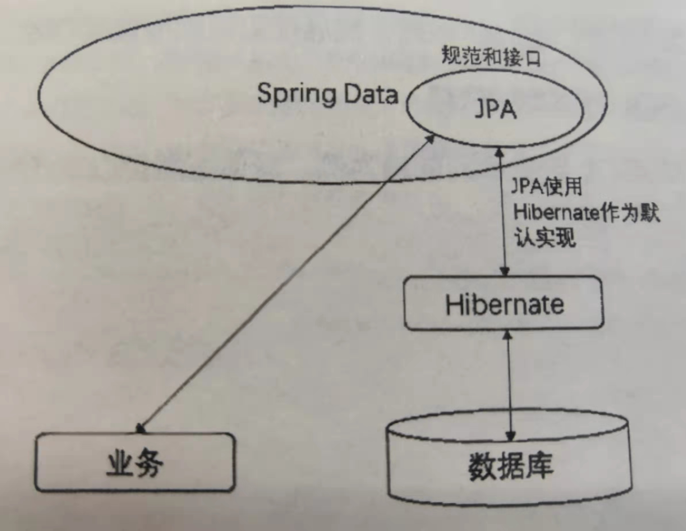

# JPA

## 一、认识JPA

* JPA（Java Persistence API）是Java的持久化API，用于对象的持久化。它是一个非常强大的ORM持久化的解决方案，免去了JDBCTemplate开发的编写脚本工作。JPA通过简单约定好就恶口方法的规则自动生成相应的JPQL语句，然后映射成POJO对象。

* JPA是一个规范化接口，封装了Hibernate的操作作为默认实现，让用户不通过任何配置即可完成数据库的操作。

  

* Hibernate主要通过hibernate-annotion、hibernate-entitymanager和hibernate-core三个组件来操作数据。
  * hibernate-annotion：是Hibernate支持annotion方式配置的基础，它包括标准的JPA annotion、Hibernate自身特殊功能的annotion。
  * hibernate-core：是Hibernate的核心实现，提供了Hibernate所有的核心功能
  * hibernate-entitymanager：实现了标准的JPA，它是hibernate-core和JPA之间的适配器，它不直接提供ORM的功能，而是对hibernate-core进行封装，使得Hibernate符合JPA的规范

## 二、使用JPA

### 1. 添加JPA和MySQL数据库的依赖

### 2. 配置数据库连接信息

```properties
spring.datasource.url=jdbc:mysql://127.0.0.1/book?useUnicode=true&characterEncoding=utf-8&serverTimezone=UTC&useSSL=true
spring.datasource.username=root
spring.datasource.password=root
spring.datasource.driver-class-name=com.mysql.cj.jdbc.Driver
spring.jpa.properties.hibernate.hbm2ddl.auto=update
spring.jpa.properties.hibernate.dialect=org.hibernate.dalect.MySQL5InnoDBDialect
spring.jpa.show-sql=true
```

* `spring.jpa.properties.hibernate.hbm2ddl.auto`:hitbernate的配置属性，其主要作用是：自动创建、更新、验证数据库表结构。其参数配置如下：

  | 属性        | 说明                                                         |
  | ----------- | ------------------------------------------------------------ |
  | create      | 每次加载Hibernate时都会删除上一次生成的表，然后根据Model类在重新生成新表，哪怕没有任何改变也会这样执行，这会导致数据库数据的丢失 |
  | create-drop | 每次加载Hibernate时会根据Model类生成表，但是sessionFactory一旦关闭，表就会自动被删除 |
  | update      | 最常用的属性。第一次加载Hibernate时会根据Model类自动建立表的结构(前提是先建立好数据库)。以后加载Hibernate时，会根据Model类自动更新表结构，即使表结构改变了，但表中的数据仍然存在，不会被删除。要注意的是，当部署到服务器后，表结构是不会被马上建立起来的，要等应用程序第一次运行起来后才会建立。Update表示如果Entity实体的字段发生了变化，那么直接在数据库中进行更新 |
  | validate    | 每次加载Hibernate时，会验证数据库的表结构，只会和数据库中的表进行比较，不会创建新表，但是会插入新值 |

## 三、了解JPA注解和属性

### 1. JPA的常用注解

