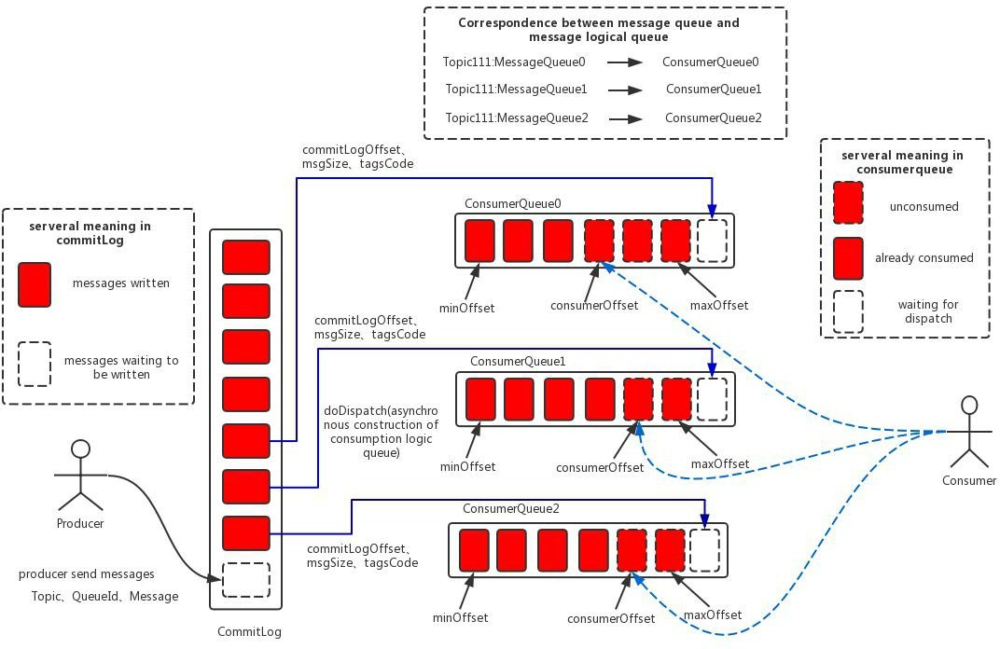
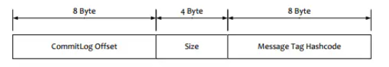
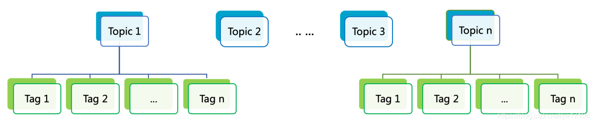

# RocketMQ

## 一、RocketMQ部署拓扑

### 1. 常用拓扑图

一个基本的部署拓扑至少包含Console管理平台、Namesrv和Broker;

* Namesrv [详解](https://blog.csdn.net/Dream__Snow/article/details/87518688)

  * 简介：Namesrv就是RMQ中的路由服务，可以类比ZK在Kafka中的作用，实现了路由管理、服务注册、服务发现等功能。
  * 功能
    * 接收Broker的请求，注册Broker路由信息（包括Master和Slave）
      * Broker启动时向所有Namesrv注册，Producer在发送消息前先从Namesrv获取Broker服务器地址列表，通过负载算法选择对应服务器进行消息发送。Namesrv与每台Broker保持长连接并进行间隔30s的心跳检测，Broker宕机则从路由注册表中删除。
    * 接收Client的请求，根据某个Topic获取所有到Broker的路由信息
  * 部署：推荐一个集群并部署2~3个Namesrv节点。Namesrv节点相互独立,无数据交互。

* Broker

  * 简介：Broker是RocketMQ的核心，大部分“重量级”工作都是由Broker完成的，包括接收Producer发过来的消息、处理Consumer的消费消息请求、消息的持久化存储、消息的HA机制以及服务端过滤功能等。

  * 部署

    Broker部署方式有5种

    * 第一种：单Master。“集群”中只有一个节点，宕机后不可用。通常用于个人入门学习，比如测试发送消息代码、测试消费消息代码，建议在生产环境中不要使用这种部署方式。
    * 第二种：单Master，单Slave。单主从模式，Master宕机后集群不可写入消息，但可以读取消息。通常用于个人深入学习，比如研究源码、设计原理等，建议在生产环境中不要使用这种部署方式。
    * 第三种：多Master、无Slave。这种部署方式性能最好，并且单个Master节点宕机时，不影响正常使用。
    * 第四种：多Master、多Slave，异步复制。在第三种方式上增加了Slave，当一个Master节点宕机时，该Master不能写入消息，消息可以在其对应的Slave中读取已发送到宕机Master中的消息。生产环境可以使用这种部署方式。
    * 第五种：多Master、多Slave，同步复制。这种部署方式完全解决了第四种部署方式的弊端，虽然由于Master-Slave同步复制导致发送消息耗时增加，集群性能大大下降，但是这仍然是最可靠的部署方式。生产环境中可以使用这种部署方式。

### 2. 同步复制、异步复制和同步刷盘、异步刷盘

* **复制**是指Broker与Broker之间的数据同步方式。分为同步和异步两种。
  * **同步复制**：生产者会等待同步复制成功后，才返回生产者消息发送成功。
  * **异步复制**：消息写入Master、Broker后即为写入成功，此时系统有较低的写入延迟和较大的系统吞吐量。
* **刷盘**是指数据发送到Broker的内存（通常指PageCache）后，以何种方式持久化到磁盘。
  * **同步磁盘**：生产者会等待数据持久化到磁盘后，才返回生产者消息发送成功，可靠性极强。
  * **异步刷盘**：消息写入PageCache即为写入成功，达到一定量时自动触发刷盘。此时系统有非常低的写入延迟和非常大的系统吞吐量。

## 二、消息存储结构

### 1. RocketMQ消息的存储形式（ConsumeQueue+CommitLog）

在CommitLog中，一个消息的存储长度是不固定的，RocketMQ采取一些机制，尽量向CommitLog中顺序写，但是随机读，每次读取消息队列先读取ConsumeQueue，然后再通过ConsumeQueue去CommitLog中拿到消息主体。（ConsumeQueue的内容也会被写到磁盘里作持久存储）

* CommitLog

  * 消息真正的物理存储文件，每台Broker上的CommitLog被本机器所有ConsumeQueue共享。消息主体以及元数据都存储在CommitLog当中。
  * 独占锁实现顺序写
    * RocketMQ目前实现了两种方式
      * 基于AQS的ReentrantLock
        * 如果底层AQS抢不到锁的话会休眠
      * 基于CAS的SpinLock
        * SpinLock会一直抢锁，造成明显的CPU占用。
        * SpinLock在trylock失败时，可以预期持有锁的线程会很快退出临界区，死循环的忙等待很可能要比进程挂起等待更高效。这也是为什么在高并发下为了保持 CPU 平稳占用而采用方式一，单次请求响应时间短的场景下采用方式二能够减少 CPU 开销
    * 获取锁之后处理
      * 预计算索引的位置ConsumeQueueOffset(需保证严格递增)
      * 计算commitLog存储位置，**physicalOffset 物理偏移量**，找到文件位置
      * 记录存储时间戳，保证消息投递时间顺序性

* ConsumeQueue

  

  * 消息的逻辑队列，类似数据库的索引文件，存储的是指向物理存储的地址.每个Topic下的每个Message Queue都有一个对应的ConsumeQueue文件。RocketMQ的ConsumeQueue中不存储具体的消息，具体的消息由CommitLog存储，ConsumeQueue中只存储路由到该queue中的消息在CommitLog中的offset，消息的大小以及消息所属的tag的hash（tagCode），一共只占20个字节
  * 每次读取消息队列先读取consumerQueue,然后再通过consumerQueue去commitLog中拿到消息主体.

### 2. 此存储结构下的优势

* CommitLog顺序写，大大提高写入效率
* 虽然是随机读，但是利用操作系统的PageCache机制，可以批量地从磁盘读取作为cache存到内存中，加速后续的读取速度
* 为了保证完全的顺序写，需要ConsumeQueue这个中间结构，在实际情况中，大部分的ConsumeQueue能够被全部读入内存，所以这个中间结构的操作速度很快，可以认为是内存读取的速度。

### 3. RocketMQ中Topic、Tag如何正确使用

* Topic：消息主题，通过 Topic 对不同的业务消息进行分类。
* Tag：消息标签，用来进一步区分某个 Topic 下的消息分类，RocketMQ 允许消费者按照 Tag 对消息进行过滤，确保消费者最终只消费到他关注的消息类型。
* Topic 与 Tag 都是业务上用来归类的标识，区分在于 Topic 是一级分类，而 Tag 可以说是二级分类，关系如图所示。

