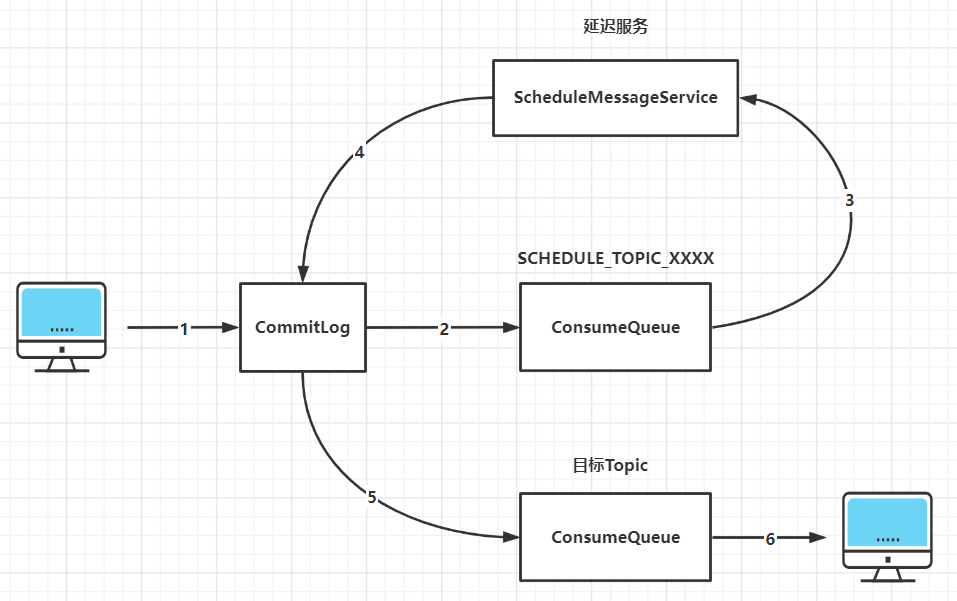

# RocketMQ

## 一、RocketMQ部署拓扑

### 1. 常用拓扑图

一个基本的部署拓扑至少包含Console管理平台、Namesrv和Broker;

* Namesrv [详解](https://blog.csdn.net/Dream__Snow/article/details/87518688)

  * 简介：Namesrv就是RMQ中的路由服务，可以类比ZK在Kafka中的作用，实现了路由管理、服务注册、服务发现等功能。
  * 功能
    * 接收Broker的请求，注册Broker路由信息（包括Master和Slave）
      * Broker启动时向所有Namesrv注册，Producer在发送消息前先从Namesrv获取Broker服务器地址列表，通过负载算法选择对应服务器进行消息发送。Namesrv与每台Broker保持长连接并进行间隔30s的心跳检测，Broker宕机则从路由注册表中删除。
    * 接收Client的请求，根据某个Topic获取所有到Broker的路由信息
  * 部署：推荐一个集群并部署2~3个Namesrv节点。Namesrv节点相互独立,无数据交互。

* Broker

  * 简介：Broker是RocketMQ的核心，大部分“重量级”工作都是由Broker完成的，包括接收Producer发过来的消息、处理Consumer的消费消息请求、消息的持久化存储、消息的HA机制以及服务端过滤功能等。

  * 部署

    Broker部署方式有5种

    * 第一种：单Master。“集群”中只有一个节点，宕机后不可用。通常用于个人入门学习，比如测试发送消息代码、测试消费消息代码，建议在生产环境中不要使用这种部署方式。
    * 第二种：单Master，单Slave。单主从模式，Master宕机后集群不可写入消息，但可以读取消息。通常用于个人深入学习，比如研究源码、设计原理等，建议在生产环境中不要使用这种部署方式。
    * 第三种：多Master、无Slave。这种部署方式性能最好，并且单个Master节点宕机时，不影响正常使用。
    * 第四种：多Master、多Slave，异步复制。在第三种方式上增加了Slave，当一个Master节点宕机时，该Master不能写入消息，消息可以在其对应的Slave中读取已发送到宕机Master中的消息。生产环境可以使用这种部署方式。
    * 第五种：多Master、多Slave，同步复制。这种部署方式完全解决了第四种部署方式的弊端，虽然由于Master-Slave同步复制导致发送消息耗时增加，集群性能大大下降，但是这仍然是最可靠的部署方式。生产环境中可以使用这种部署方式。

### 2. 同步复制、异步复制和同步刷盘、异步刷盘

* **复制**是指Broker与Broker之间的数据同步方式。分为同步和异步两种。
  
  * **同步复制**：生产者会等待同步复制成功后，才返回生产者消息发送成功。
  * **异步复制**：消息写入Master、Broker后即为写入成功，此时系统有较低的写入延迟和较大的系统吞吐量。
* **刷盘**是指数据发送到Broker的内存（通常指PageCache）后，以何种方式持久化到磁盘。
  * **同步磁盘**：生产者会等待数据持久化到磁盘后，才返回生产者消息发送成功，可靠性极强。
  * **异步刷盘**：消息写入PageCache即为写入成功，达到一定量时自动触发刷盘。此时系统有非常低的写入延迟和非常大的系统吞吐量。
  
  

## 二、消息存储结构

### 1. RocketMQ消息的存储形式（ConsumeQueue+CommitLog）

在CommitLog中，一个消息的存储长度是不固定的，RocketMQ采取一些机制，尽量向CommitLog中顺序写，但是随机读，每次读取消息队列先读取ConsumeQueue，然后再通过ConsumeQueue去CommitLog中拿到消息主体。（ConsumeQueue的内容也会被写到磁盘里作持久存储）

* CommitLog

  * 消息真正的物理存储文件，每台Broker上的CommitLog被本机器所有ConsumeQueue共享。消息主体以及元数据都存储在CommitLog当中。
  * 独占锁实现顺序写
    * RocketMQ目前实现了两种方式
      * 基于AQS的ReentrantLock
        * 如果底层AQS抢不到锁的话会休眠
      * 基于CAS的SpinLock
        * SpinLock会一直抢锁，造成明显的CPU占用。
        * SpinLock在trylock失败时，可以预期持有锁的线程会很快退出临界区，死循环的忙等待很可能要比进程挂起等待更高效。这也是为什么在高并发下为了保持 CPU 平稳占用而采用方式一，单次请求响应时间短的场景下采用方式二能够减少 CPU 开销
    * 获取锁之后处理
      * 预计算索引的位置ConsumeQueueOffset(需保证严格递增)
      * 计算commitLog存储位置，**physicalOffset 物理偏移量**，找到文件位置
      * 记录存储时间戳，保证消息投递时间顺序性

* ConsumeQueue

  

  * 消息的逻辑队列，类似数据库的索引文件，存储的是指向物理存储的地址.每个Topic下的每个Message Queue都有一个对应的ConsumeQueue文件。RocketMQ的ConsumeQueue中不存储具体的消息，具体的消息由CommitLog存储，ConsumeQueue中只存储路由到该queue中的消息在CommitLog中的offset，消息的大小以及消息所属的tag的hash（tagCode），一共只占20个字节
  * 每次读取消息队列先读取consumerQueue,然后再通过consumerQueue去commitLog中拿到消息主体.

### 2. 此存储结构下的优势

* CommitLog顺序写，大大提高写入效率
* 虽然是随机读，但是利用操作系统的PageCache机制，可以批量地从磁盘读取作为cache存到内存中，加速后续的读取速度
* 为了保证完全的顺序写，需要ConsumeQueue这个中间结构，在实际情况中，大部分的ConsumeQueue能够被全部读入内存，所以这个中间结构的操作速度很快，可以认为是内存读取的速度。

### 3. RocketMQ中Topic、Tag如何正确使用

* Topic：消息主题，通过 Topic 对不同的业务消息进行分类。
* Tag：消息标签，用来进一步区分某个 Topic 下的消息分类，RocketMQ 允许消费者按照 Tag 对消息进行过滤，确保消费者最终只消费到他关注的消息类型。
* Topic 与 Tag 都是业务上用来归类的标识，区分在于 Topic 是一级分类，而 Tag 可以说是二级分类，关系如图所示。

## 三、消息存储

### 1. RocketMQ工作流程

(1) 消息生成者发送消息

(2) MQ收到消息，将消息进行持久化，在存储中新增一条记录

(3) 返回ACK给生产者

(4) MQ push 消息给对应的消费者，然后等待消费者返回ACK

(5) 如果消息消费者在指定时间内成功返回ack，那么MQ认为消息消费成功，在存储中删除消息，即执行第6步；如果MQ在指定时间内没有收到ACK，则认为消息消费失败，会尝试重新push消息,重复执行4、5、6步骤

(6) MQ删除消息

### 2. 消息的存储和发送

#### （1） 消息存储

* 磁盘如果使用得当，磁盘的速度完全可以匹配上网络的数据传输速度。目前的高性能磁盘，顺序写速度可以达到600MB/s， 超过了一般网卡的传输速度。但是磁盘随机写的速度只有大概100KB/s，和顺序写的性能相差6000倍！因为有如此巨大的速度差别，好的消息队列系统会比普通的消息队列系统速度快多个数量级。RocketMQ的消息用顺序写,保证了消息存储的速度

#### （2） 消息发送 

* Linux操作系统分为【用户态】和【内核态】，文件操作、网络操作需要涉及这两种形态的切换，免不了进行数据复制。

  一台服务器把本机磁盘文件的内容发送到客户端，一般分为两个步骤：

  * read：读取本地文件内容
  * write：将读取的内容通过网络发送出去

  这两个操作发生了两次系统调用，每次系统调用都得先从用户态切换到内核态，等内核完成任务后，再从内核态切换回用户态，也就是消息发送过程中一共发生了 **4 次用户态与内核态的上下文切换**。另外还**发生了 4 次数据拷贝**，其中两次是 DMA 的拷贝，另外两次则是通过 CPU 拷贝的，分别是：

  1. DMA把数据从磁盘拷贝到内核态缓冲区；
  2. CPU把数据从内核态缓冲区拷贝到用户缓冲区；
  3. CPU把数据从用户缓冲区拷贝到内核的网络驱动的 socket 缓冲区；
  4. DMA把数据从网络驱动的 socket 缓冲区拷贝到网卡的缓冲区中

  

  通过使用mmap的方式，可以省去向用户态的内存复制，提高速度。这种机制在Java中是通过MappedByteBuffer实现的

  RocketMQ充分利用了上述特性，也就是所谓的“零拷贝”技术，提高消息存盘和网络发送的速度。[零拷贝详解](https://blog.csdn.net/qq_40744423/article/details/124563671)

  * 这里需要注意的是，采用MappedByteBuffer这种内存映射的方式有几个限制，其中之一是一次只能映射1.5~2G 的文件至用户态的虚拟内存，这也是为何RocketMQ默认设置单个CommitLog日志数据文件为1G的原因了

## 四、事务消息实现机制

[参考详解](https://blog.csdn.net/yh4494/article/details/128475936)

当我们在业务逻辑中发送消息时，消息与业务的事务之间难以保证一致性，如果业务代码出现异常，如果已发送的消息无法回滚，则会出现数据不一致的情况，RocketMQ的事务消息支持在业务逻辑与发送消息之间提供事务保证，RocketMQ通过两阶段的方式提供事务消息的支持。

### 1. 什么是半消息（事务消息）

* 事务消息：MQ提供类似X/Open XA的分布事务功能，通过MQ事务消息能达到分布式事务的最终一致。
* 半消息：暂不能投递的消息，发送方已经将消息成功发送到了MQ服务端，但是服务端未收到生产者对该消息的二次确认，此时该消息被标记成“暂不能投递”状态，处于该种状态下的消息即半消息。
* 半消息回查：由于网络闪断、生产者应用重启等原因，导致某条事物消息的二次确认丢失，MQ服务端通过扫描发现某条消息长期处于“半消息”时，需要主动向消息生产者询问该消息的最终状态（Commit或是Rollback）。该过程即消息回查

### 2. 半消息事务实现流程

Apache RocketMQ在4.3.0版本中已经支持分布式事务，采用了**2PC（两阶段提交）+补偿机制（事务状态回查）**的思想来实现了提交事务消息，同时增加一个补偿逻辑来处理二阶段超时或者失败的消息，如下图所示

#### （1） 正常事务消息的发送及提交

* 生产者发送half消息到Broker服务端（半消息）
* Broker服务端将消息持久化之后，给生产者响应消息写入结果（ACK响应）
* 生产者根据发送结果执行本地事务逻辑（如果写入失败，此时half消息对业务不可见，本地逻辑不执行）
* 生产者根据本地事务执行结果向Broker服务端提交二次确认（Commit或是Rollback），Broker服务端收到Commit状态则将半事务消息标记为可投递，订阅方最终将收到该消息；Broker服务端收到Rollback状态则删除半事务消息，订阅方将不会接收该消息。

#### （2） 事务消息的补偿流程

* 在网络闪断或是应用重启的情况下，可能导致生产者发送的二次确认消息未能达到Broker服务端，经过固定时间后，Broker服务端将会对没有Commit/Rollback的事务消息（pending状态的消息）进行“回查”；
* 生产者收到回查消息后，检查回查消息对应的本地事务执行的最终结果
* 生产者根据本地事务状态，再次提交二次确认给Broker，然后Broker重新对半事务消息Commit或者Rollback

#### （3） 事务消息的三种状态

* TransactionStatus.CommitTransaction：提交事务，它允许消费者消费此消息
* TransactionStatus.RollbackTransaction：回滚事务，它代表该消息将被删除，不允许被消费
* TransactionStatus.Unknown：中间状态，它代表需要回查本地事务状态来决定是提交还是回滚事务

### 3. RocketMQ事务消息原理

#### （1） 设计思想

* 在RocketMQ事务消息的主要流程中，一阶段的消息如何对用户不可见。其中，事务消息相对普通消息最大的特点就是**一阶段发送的消息对用户是不可见的**。
* RocketMQ事务消息的做法是：如果消息是half消息，将备份原消息的主题与消息消费队列，然后改变主题为RMQ_SYS_TRANS_HALF_TOPIC。由于消费组未订阅该主题，故消费端无法消费half类型的消息。

#### （2） 如何实现事务回查

* Broker会启动一个消息回查的定时任务，定时从事务消息queue中读取所有待回查的消息。
* 针对每个需要回查的半消息，Broker会给对应的Producer发一个要求执行事务状态回查的RPC请求。然后根据RPC返回响应中的反查结果，来决定这个半消息是需要提交还是回滚，或者后续继续来回查。
* 最后，提交或者回滚事务，将半消息标记为已处理状态（将消息存储在主题为：RMQ_SYS_TRANS_OP_HALF_TOPIC的主题中，代表这些消息已经被处理）
* 如果是提交事务，就把半消息从半消息队列中复制到该消息真正的topic和queue中；如果是回滚事务，则什么都不做
* 注意，RocketMQ并不会无休止地进行事务消息状态的回查，默认回查15次，如果15次回查还是无法得知事务状态，RocketMQ默认回滚该事务消息。

## 五、RocketMQ的Topic、Topic分片

[详解](https://blog.csdn.net/fedorafrog/article/details/115469877)

## 六、RocketMQ延时消息

[参考详解](https://blog.csdn.net/Weixiaohuai/article/details/123658301)

### 1. 什么是延时消息

* 当消息写入Broker后，不能立刻被消费者消费，需要等待指定的时长后才可被消费者处理的消息，称为延时消息。

### 2.  延时消息等级

* RocketMQ延时消息的延迟时长不支持随意时长的延迟，是通过特定的延迟等级来指定的。默认支持18个等级的延迟消息。

### 3. 延时消息实现原理

* RocketMQ延时消息会暂存在名为SCHEDULE_TOPIC_XXXX的Topic中，并根据delayTimeLevel存入特定的queue，queueId=delayTimeLevel-1，即一个queue只存相同延迟的消息，保证具有相同发送延迟的消息能够顺序消费。Broker会调度地消费SCHEDULE_TOPIC_XXXX，将消息写入真实的topic。

* 延迟消息在RocketMQ Broker端的流转如图所示：

  

  主要包含以下6个步骤

  * 修改消息Topic名称和队列信息
    * RocketMQ Broker端在存储生产者写入的消息时，首先都会将其写入到CommitLog中。之后根据消息中的Topic信息和队列信息，将其转发到目标Topic的指定队列（ConsumeQueue）中。
    * 由于消息一旦存储到ConsumeQueue中，消费者就能消费到，而延迟消息不能被立刻消费，所以这里将Topic的名称修改为SCHEDULE_TOPIC_XXXX，并根据延迟级别确定要投递到哪个队列下。同时，还会将消息原来要发送到的目标Topic和队列信息存储到消息的属性中。
  * 转发消息到延迟主题SCHEDULE_TOPIC_XXXX的CosumeQueue中
    * CommitLog中的消息转发到CosumeQueue中是异步进行的。在转发过程中，会对延迟消息进行特殊处理，主要是计算这条延时消息需要在什么时候进行投递
    * 投递时间=消息存储时间（storeTimestamp）+延迟级别对应的时间
    * 需要注意的是，会将计算出的投递时间当做消息Tag的哈希值存储到CosumeQueue中。
  * 延迟服务消费SCHEDULE_TOPIC_XXXX消息
    * Broker内部有一个ScheduleMessageService类，其充当延迟服务，主要是消费SCHEDULE_TOPIC_XXXX中的消息，并投递到目标Topic中。
    * ScheduleMessageService在启动时，其会创建一个定时器Timer，并根据延迟级别的个数，启动对应数量的TimerTask，每个TimerTask负责一个延迟级别的消费与投递。
    * 需要注意的是，每个TimerTask在检查消息是否到期时，首先检查对应队列中尚未投递第一条消息，如果这条消息没到期，那么之后的消息都不会检查。如果到期了，则进行投递，并检查之后的消息是否到期。
  * 将信息重新存储到CommitLog中
    * 在将消息到期后，需要投递到目标Topic。由于在第一步已经记录了原来的Topic和队列信息，因此这里重新设置，在存储到CommitLog即可。此外，由于之前Message Tag HashCode字段存储的是消息的投递时间，这里需要重新计算tag的哈希值后再存储。
  * 将消息投递到目标Topic中
    * 这一步与第二步类似，不过由于消息的Topic名称已经改为了目标Topic，因此消息会直接投递到目标Topic的ConsumeQueue中，之后消费者即可消费到这条消息。
  * 消费者消费Topic中的数据

