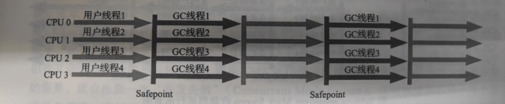
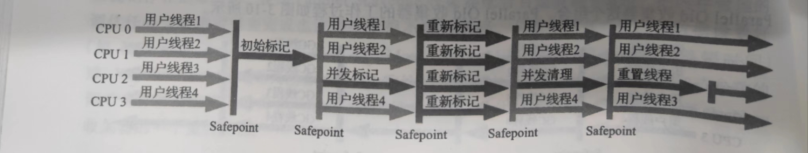

# 深入理解Java虚拟机

Java开发技术本身的一个重要优点——在任意一台Java虚拟机上编译的程序，都能在任何其它Java虚拟机上正常运行。

## 一、走进Java

### 1. Java虚拟机家族

（只讲解部分）

* 虚拟机始祖：Sun Classic / Exact VM
  * Sun Classic 是世界上第一款商用Java虚拟机。
    * 这款虚拟机只能使用纯解释器方式来执行Java代码，如果要使用即时编译器那就必须外挂，但是假设外挂了即时编译器的话，即时编译器就会完全接管虚拟机的执行系统，解释器便不能再工作了。
    * 由于解释器和编译器不能配合工作，这就意味着如果要使用编译执行，编译器就不得不对每一个方法、每一行代码都进行编译，而无论他们执行的频率是否具有编译的价值。
  * Exact VM —— 它的编译执行系统已经具备现代高性能虚拟机雏形，如热点探测、两级即时编译器、编译器与解释器混合工作模式等。
    * Exact VM因它使用准确式内存管理（Exact Memory Management）而得名。
    * 准确式内存管理是指虚拟机可以知道内存中某个位置的数据具体是什么类型。
    * 由于使用了准确式内存管理，Exact VM可以抛弃以前Classic VM**基于句柄（Handle）的对象查找方式**（在第二章有介绍），这样每次定位对象都少了一次间接查找的开销，显著提升执行性能。

* 武林盟主： HotSpot VM
  * HotSpot既继承了Sun之前两款商用虚拟机的优点（如前面提到的准确式内存管理），也有许多自己新的技术优势。
  * 热点代码探测技术： 可以通过执行计数器找出最具有编译价值的代码，然后通知即时编译器以方法为单位进行编译。
  * 如果一个方法被频繁调用，或方法中有效循环次数很多，将会分别触发标准即时编译和栈上替换编译（On-Stack Replacement， OSR）行为。通过编译器与解释器恰当地协同工作，可以在最优化的程序响应时间与最佳执行性能中取得平衡，而且无须等待本地代码输出才能执行程序，即时编译的时间压力也相对减小，这样有助于引入更复杂的代码优化技术，输出质量更高的本地代码。

### 2.  新一代即时编译器

* HotSpot虚拟机中含有两个即时编译器，分别是
  * 编译耗时短但输出代码优化程度较低的客户端编译器——简称为C1
  * 编译耗时长但输出代码优化质量也更高的服务端编译器——简称为C2
  * 通常它们会在分层编译机制下与解释器互相配合来共同构成HotSpot虚拟机的执行子系统
* 自JDK10起，HotSpot中又加入了一个全新的即时编译器——Graal编译器，Graal编译器是以C2编译器替代者的身份登场的。
  * Graal编译器在保持输出相近质量的编译代码同时，开发效率和扩展性上都要显著优于C2编译器，这决定了C2编译器中优秀的代码技术可以轻易地移植到Graal编译器上，但是反过来Graal编译器中行之有效的优化在C2编译器里实现起来则异常艰难。
  * Graal能过够做比C2更加复杂的优化，如“部分逃逸分析”（Partial Escape Analysis），也拥有比C2更容易使用激进预测性优化（Aggressive Speculative Optimization）的策略，支持自定义的预测性假设等。

### 3. 向Native迈进

* 在微服务架构的视角下，应用拆分后，单个微服务很可能就不再需要面对数十、数百GB乃至TB的内存，有了高可用的服务集群，也无须追求单个服务要7×24小时不间断地运行，它们随时可以中断和更新。
* 但相应的，Java的启动时间相对较长，需要预热才能达到最高性能的特点就显得相悖于这样的应用场景。

#### 提前编译（Ahead of Time Compilation, AOT）

* 提前编译是相对于即时编译的概念，提前编译能带来的最大好处是Java虚拟机加载这些已经预编译成二进制库之后就能够直接调用，而无须再等待即时编译器在运行时将其编译成二进制机器码。
* 理论上，提前编译可以减少即时编译带来的预热时间，减少Java应用长期给人带来“第一次运行慢”的不良体验，可以放心地进行很多全程序的分析行为，可以使用时间压力更大的优化措施。
* 但是提前编译的坏处也很明显，它破坏了Java“一次编写，到处运行”的承诺，必须为每个不同的硬件、操作系统去编译对应的发行包，也显著降低了Java链接过程的动态型，必须要求加载的代码在编译器就是全部已知的，而不能在运行期才确定，否则就只能舍弃掉已经提前编译好的版本，退回到原来的即时编译执行状态。

### 4. 实战：编译JDK

[基于Ubuntu20.04.3平台编译OpenJDK12](https://blog.csdn.net/HardyZhan/article/details/122308955?spm=1001.2014.3001.5501)

## 二、自动内存管理

### 1. Java内存区域与内存溢出异常

#### （1）运行时数据区域

##### a. 线程私有

* **程序计数器**，它是一块较小的内存空间，可以看作是当前线程所执行的字节码的行号指示器。在Java虚拟机的概念模型里，字节码解释器工作时就是通过改变这个计数器的值来选取下一条需要执行的字节码指令，它是程序控制流的指示器，分支、循环、跳转、异常处理、线程恢复等基础功能都需要依赖这个计数器来完成。
* **Java虚拟机栈**，它的生命周期与线程相同。虚拟机栈描述的是Java方法执行的线程内存模型：每个方法被执行的时候，Java虚拟机都会同步创建一个栈帧用于存储**局部变量表**、**操作数栈**、**动态连接**、**方法出口**等信息。每一个方法被调用直至执行完毕的过程，就对应着一个栈帧在虚拟机栈中从入栈到出栈的过程。
  * **局部变量表**
    * 存放了编译器可知的各种Java虚拟机**基本数据类型**（boolean、byte、char、short、int、float、long、double）、**对象引用**（reference类型，它并不等同于对象本身，可能是一个指向对象起始地址的引用指针，也可能是指向一个代表对象的句柄或者其它于此对象相关的位置）和**returnAddress类型**（指向了一条字节码指令的地址）。
    * 这些数据类型在局部变量表中的存储空间是以局部变量槽（Slot）来表示，其中64位长度的long和double类型的数据会占用两个变量槽，其余的数据类型只占用一个。
    * 局部变量表所需的内存空间在编译器间完成分配，当进入一个方法时，这个方法需要在栈帧中分配多大的局部变量空间是完全确定的，在方法运行期间不会改变局部变量表的大小（这里的大小是指变量槽的数量，虚拟机真正使用多大的内存空间来实现一个变量槽，完全由具体的虚拟机实现自行决定）。
  * 在《Java虚拟机规范》中，对这个内存区域规定了**两类异常状况**
    * 如果线程请求的栈深度大于所允许的深度，将抛出StackOverflowError异常；
    * 如果Java虚拟机栈容量可以动态扩展，当栈扩展时无法申请到足够的内存会抛出OutOfMemoryError异常；
* **本地方法栈**，它与虚拟机栈所发挥的作用是非常相似的，其区别只是虚拟机栈为虚拟机执行Java方法（也就是字节码）服务，而本地方法栈则是为虚拟机使用到的本地（Native）方法服务。

##### b. 线程共享

* **Java堆**，它是虚拟机所管理的内存中最大的一块。Java堆是被所有线程共享的一块内存区域，在**虚拟机启动时**创建。此内存区域的唯一目的就是存放实例对象，Java世界里“几乎”所有的对象实例都在这里分配内存。由于即时编译技术的进步，尤其是逃逸分析技术的日渐强大，栈上分配、标量替换优化手段已经导致一些微妙的变化悄然发生，所以说Java对象实例都分配在堆上也渐渐变得不是那么绝对了。
  * JAVA堆是垃圾收集器管理的区域，因此一些资料中它也被称作“GC堆”（Garbage Collected Heap）。
  * 如果从分配内存的角度看，所有线程共享的Java堆中可以划分出多个线程私有的分配缓冲区（Thread Local Allocation Buffer， TLAB），以提升对象分配时的效率。
  * 根据《Java虚拟机规范》的规定，Java堆可以处于**物理上**不连续的内存空间，但在逻辑上它应该被是为连续的。
  * Java堆既可以被实现成固定大小的，也可以是可扩展的，不过当前主流的Java虚拟机都是按照可扩展来实现的（通过参数-Xmx和-Xms设定）。如果在Java堆中没有内存完成实例分配，并且堆也无法在扩展时，Java虚拟机将会抛出OutOfMemoryError异常。
* **方法区**，它用于存储已被虚拟机加载的**类型信息**、**常量**、**静态变量**、**即时编译器编译后的代码缓存**等数据。
  * **方法区和永久代以及元空间是什么关系呢？** 方法区和永久代以及元空间的关系很像 Java 中接口和类的关系，类实现了接口，这里的类就可以看作是永久代和元空间，接口可以看作是方法区，也就是说永久代以及元空间是 HotSpot 虚拟机对虚拟机规范中方法区的两种实现方式。并且，永久代是 JDK 1.8 之前的方法区实现，JDK 1.8 及以后方法区的实现变成了元空间。
  * **运行时常量池**（Runtime Constant Pool），是方法区的一部分。Class文件中除了有类的版本、字段、方法、接口等描述信息外，还有一项信息是常量池表（Constant Pool Table），用于存放编译器生成的各种字面量与符号引用，这部分内容将在类加载后存放到方法区的运行时常量池中。
    * 运行时常量池相对于Class文件常量池的另外一个重要特征是具备动态性，Java语言并不要求常量一定只有编译器才能产生，也就是说，并非预置入Class文件中常量池的内容才能进入方法区运行时常量池，运行期间也可以将新的常量放入池中，这种特性被开发人员利用的比较多的便是String类的intern()方法。
    * 既然运行时常量池是方法区的一部分，自然受到方法区内存的限制，当常量池无法再申请到内存时会抛出OutOfMemoryError异常。

#### （2）直接内存

* JDK1.4 中新加入的 **NIO(New Input/Output) 类**，引入了一种基于**通道（Channel）**与**缓存区（Buffer）**的 I/O 方式，它可以直接使用 Native 函数库直接分配堆外内存，然后通过一个存储在 Java 堆中的 DirectByteBuffer 对象作为这块内存的引用进行操作。这样就能在一些场景中显著提高性能，因为**避免了在 Java 堆和 Native 堆之间来回复制数据**。

#### （3）HotSpot虚拟机对象探秘

##### a. 对象的创建

（以下按过程顺序排列）

* **类加载检查**。
  * 当Java虚拟机遇到一条字节码new指令时，首先将去检查这个指令的参数是否能在常量池中定位到一个类的符号引用，并且检查这个符号引用代表的类是否已被加载、解析和初始化过。如果没有，那必须限制性相应的类加载过程。
* **分配内存**。对象所需内存的大小在类加载完成后便可完全确定，而分配内存的方式有两种：
  * **指针碰撞**：假设Java堆中内存是绝对规整的，所有被使用过的内存都被放在一边，空间的内存被放在另一边，中间放着一个指针作为分界点的指示器，那所分配内存就仅仅是把那个指针向空闲空间方向挪动一段与对象大小相等的距离。
  * **空闲列表**：如果Java堆中的内存并不是规整的，已被使用的内存和空闲的内存相互交错在一起，虚拟机就必须维护一个列表，记录上哪些内存块是可用的，在分配的时候从列表中找到一块足够大的空间划分给对象实例，并更新列表上的记录。
  * 选择哪种分类方式由Java堆是否规整决定，而Java堆是否规整又有所采用的垃圾收集器是否带有空间压缩整理（Compact）的能力决定。因此当使用Serial、ParNew等带压缩整理过程的收集器时，系统采用的分配算法时指针碰撞，既简单又高效；而当使用CMS这种基于清除（Sweep）算法的收集器时，理论上就只能采用较为复杂的空闲列表来分配内存。
  * **内存分配的并发问题**
    * 对象创建在虚拟机中时非常频繁的行为，即使仅仅修改一个指针所指向的位置，在并发情况下也并不是线程安全的，可能出现正在给对象A分配内存，指针还没来得及修改，对象B又同时使用了原来的指针来分配内存的情况。
    * 解决方案
      * 对分配内存空间的动作进行同步处理——实际上虚拟机是采用CAS配上失败重试的方式保证更新造作的原子性。
      * 把内存分配的动作按照线程划分在不同的空间之中进行，即每个线程在Java堆中预先分配一小块内存，成为本地线程分配缓冲（TLAB），哪个线程要分配内存，就在哪个线程的本地缓冲区中分配，只有本地缓冲区用完了，分配新的缓存区时才需要同步锁定。虚拟机是否使用TLAB，可以通过-XX:+/-UseTLAB参数来设定。
* **初始化零值**
  * 内存分配完成后，虚拟机必须将分配到的内存空间（但不包括对象头）都初始化为零值，如果使用了TLAB的话，这一项工作也可以提前至TLAB分配时顺便进行。
  * 这步操作保证了对象的实例字段在Java代码中可以不赋初始值就直接使用，使程序能访问到字段的数据类型所对应的零值。
* **设置对象头**，包括
  * 这个对象是哪个类的实例
  * 如何才能找到类的元数据信息
  * 对象的哈希码（实际上对象的哈希码会延后到真正调用Object::hashCode()方法时才计算）
  * 对象的GC分代年龄等信息
  * 这些信息存放在对象头之中，根据虚拟机当前运行状态的不同，如是否启用偏向锁等，对象头会有不同的设置方式。
* **执行init方法**
  * 在上面工作都完成之后，从虚拟机的视角来看，一个新的对象已经产生了，但从 Java 程序的视角来看，对象创建才刚开始，`<init>` 方法还没有执行，所有的字段都还为零。所以一般来说，执行 new 指令之后会接着执行 `<init>` 方法，把对象按照程序员的意愿进行初始化，这样一个真正可用的对象才算完全产生出来。

##### b. 对象的内存布局

* 在HotSpot虚拟机里，对象在堆内存中的存储布局可以划分为三个部分：

  * 对象头（Header），HotSpot虚拟机对象的对象头部分包括两类信息：

    * 第一类是用于存储对象自身的运行时数据，如哈希码、GC分代年龄、锁状态标志、线程持有的锁、偏向线程ID、偏向时间等

    | 存储内存                             | 标志位 | 状态               |
    | ------------------------------------ | ------ | ------------------ |
    | 对象哈希码、对象分代年龄             | 01     | 未锁定             |
    | 指向所记录的指针                     | 00     | 轻量级锁定         |
    | 指向重量级锁的指针                   | 10     | 膨胀（重量级锁定） |
    | 空，不需要记录信息                   | 11     | GC标记             |
    | 偏向线程ID、偏向时间戳、对象分代年龄 | 01     | 可偏向             |

    * 另一部分是类型指针，即对象指向它的类型元数据的指针，Java虚拟机通过这个指针来确定该对象是哪个类的实例。并不是所有的虚拟机实现都必须在对象数据上保留类型指针。如果对象是一个Java数组，那在对象头中还必须有一块用于记录数组长度的数据。

  * 实例数据（Instance Data）

    * 实例数据部分是对象真正存储的有效信息，即我们在程序代码里面所定义的各种类型的字段内容，无论是从父类继承下来的，还是在子类中定义的字段都必须记录起来。这部分的存储顺序会收到虚拟机分配策略参数（-XX:FieldsAllocationStyle参数）和字段在Java源码中定义顺序的影响。HotSpot虚拟机默认的分配顺序为longs/doubles、ints、shorts、chars、bytes/booleans、oops(Ordinary Object Pointer, OOPs)。

  * 对齐填充（Padding）

    * 这不是必然存在的，也没有特别的含义，它仅仅起着占位符的作用。
    * 由于HotSpot虚拟机的自动内存管理系统要求对象起始地址必须是8字节的整数倍，换句话说就是任何对象的大小都必须是8字节的整数倍。

##### c. 对象的访问定位

* 我们的Java程序会通过栈上的reference数据来操作堆上的具体对象，而对象的访问方式是由虚拟机实现决定的，主流的访问方式主要有两种：

  * 使用句柄

    * Java堆中会划分出一块内存来作为句柄池，reference中存储的就是对象的句柄地址，而句柄中包含了对象实例数据于类型数据各自具体的地址信息，如下图所示。

    

    * 使用句柄来访问的最大好处就是reference中存储的是稳定的句柄地址，在对象被移动（垃圾收集时移动对象是非常普遍的行为）时只会改变句柄中的实例数据指针，而reference本身不需要被修改。

  * 直接指针

    * Java堆中对象的内存布局必须考虑如何放置访问类型数据的相关信息，reference中存储的直接就是对象对象地址，如果只是访问对象本身的话，就不需要多一次间接访问的开销，如下图所示。

    

  * 使用直接指针来访问最大的好处就是速度更快，它节省了一次指针定位的时间开销。

### 2. 垃圾收集器与内存分配策略

### （1） 对象已死？

垃圾收集器在对堆进行回收之前，第一件事情就是要确定这些对象之中哪些还“存活”着，哪些已经“死去”（“死去”即不可能再被任何途径使用的对象）了。

#### a. 引用计数法

* 在对象中添加一个引用计数器，每当有一个地方引用它时，计数器值就加一；当引用失效时，计数器值就减一；任何时刻计数器为零的对象就是不可能再被使用的。
* 但是，在Java领域，至少主流的Java虚拟机里面都没有选用引用计数算法来管理内存，主要原因是，这个看似简单的算法有很多例外情况要考虑，必须要配合大量额外处理才能保证正确地工作，譬如单纯的引用技术就很难解决对象之间相互循环引用的问题。

#### b. 可达性分析算法

* 当前主流的商用程序语言的内存管理子系统，都是通过可达性算法（Reachability Analysis）算法来判定对象是否存活的。
* 这个算法的基本思路就是通过一系列成为“GC Roots”的根对象作为起始节点集，从这些节点开始，根据引用关系向下搜索，搜索过程所走过的路径称为“引用链”（Reference Chain），如果这个对象到GC Roots间没有任何引用链相连，或者用图论的话来说就是从GC Roots到这个对象不可达时，则证明此对象是不可能再被使用的。

#### c. 再谈引用

无论是通过引用计数算法判断对象的引用数量，还是通过可达性分析算法判断对象是否引用链可达，判定对象是否存活都和“引用”离不开关系。

* 在JDK1.2之前，Java里面的引用是很传统的定义；如果reference类型的数据中存储的数值代表的是另外一块内存的起始地址，就称该reference数据是代表某块内存、某个对象的引用。
* 在JDK1.2之后，Java堆引用的概念进行了扩充，将引用分为
  * 强引用（Strongly Reference）
    * 是最传统的“引用”的定义，是指在程序代码之中普遍存在的引用赋值。无论任何情况下，只要强引用关系还在，垃圾收集器就永远不会回收掉被引用的对象。
  * 软引用（Soft Reference）
    * 是用来描述一些还有用，但并非必须的对象。只被软引用关联着的对象，在系统将要发生内存溢出异常前，会把这些对象列进回收范围之中进行第二次回收，如果这次回收还没有足够的内存，才会抛出内存溢出异常。
  * 弱引用（Weak Reference）
    * 是用来描述那些非必须对象，但是它的强度比软引用更弱一点，被弱引用关联的对象只能生存到下一次垃圾收集发生为止。当垃圾收集器开始工作，无论当前内存是否足够，都会回收掉只被弱引用关联的对象。
  * 虚引用（Phantom Reference）
    * 也称为“幽灵引用”或者“幻影引用”，是最弱的一种引用关系。
    * 一个对象是否有虚引用的存在，完全不会对其生存时间构成影响，也无法通过虚引用来取得一个对象实例。为一个对象设置虚引用关联的唯一目的只是为了能在这个对象被收集器回收时收到一个系统通知。

#### d. 生存还是死亡

即使在可达性分析算法中判定为不可达的对象，也不是“非死不可”的，这时候它们暂时还处于“缓刑”阶段，要真正宣告一个对象死亡，至少要经历**两次标记过程**

* 如果对象在进行可达性分析后发现没有与GC Roots相连接的引用链，那么它将会被**第一次标记**，随后进行一次筛选：
  * 筛选的**条件**是此对象是否有必要执行finalize()方法。
  * 判断“没有必要执行”的两种情况
    * 对象没有覆盖finalize()方法
    * finalize()方法已经被虚拟机调用过
* 如果对象被判定为确有必要执行finalize()方法，并且如果对象要在finalize()方法中成功拯救自己，它只要重新与引用链上的任何一个对象建立关联即可。
* 如果对象这时候还没有逃脱，那么在第二次标记时就会被回收。

#### e. 回收方法区

方法区的垃圾收集主要回收两部分内容

* 废弃的常量

* 不再使用的类型

  判定一个类型是否输于“不再使用的类”的条件，需要同时满足下面三个条件

  * 该类所有的实例都已经被回收，也就是Java堆中不存在该类及其任何派生子类的实例。
  * 加载该类的类加载器已经被回收，这个条件除非是经过精心设计的可替换类加载器的场景，如OSGi、JSP的重加载等，否则通常是很难达成的。
  * 该类对应的java.lang.Class对象没有在任何地方被引用，无法在任何地方通过反射访问该类的方法。

* Java虚拟机被允许对满足上述三个条件的无用类进行回收，这里说的仅仅是“被允许”，而不是和对象一样，没有引用了就必然会被回收。关于是否要对类型进行回收，HotSpot虚拟机提供了-Xnoclassgc参数进行控制。

### （2） 垃圾收集算法

从如何判断对象消亡的角度出发，垃圾收集算法可以划分为

* 引用计数式垃圾收集，也称作“直接垃圾收集”
* 追踪式垃圾收集，也称作“间接垃圾收集”

以下介绍的所有算法均属于追踪式垃圾收集

#### a. 分代收集理论

当前商业虚拟机的垃圾收集器，大多数都遵循了“分代收集”（Generational Collection）的理论进行设计，分代收集名为理论，实质是一套符合大多数程序运行实际情况的经验法则，它建立在两个分代假说之上

* 弱分代假说（Weak Generational Hypothesis）：绝大多数对象都是朝生夕灭的
* 强分代假说（Strong Generational Hypothesis）：熬过越多次垃圾收集过程的对象就越难以消亡

这两个分代假说共同奠定了多款常用的垃圾收集器的一致的设计原则

* 收集器应该将Java堆划分出不同的区域，然后将回收对象依据其年龄（年龄即对象熬过垃圾收集过程的次数）分配到不同的区域之中存储。

针对不同分代的垃圾收集的名词定义

* 部分收集（Partial GC）：指目标不是完整收集整个Java堆的垃圾收集，其中又分为
  * 新生代收集（Minor GC / Young GC）：指目标只是新生代的垃圾收集
  * 老年代收集（Major GC / Old GC）：指目标只是老年代的垃圾收集。目前只有CMS收集器会有单独收集老年代的行为。
  * 混合收集（Mixed GC）：指目标是收集整个新生代以及部分老年代的垃圾收集。目前只有G1收集器会有这种行为。
* 整堆收集（Full GC）：收集整个Java堆和方法去的垃圾收集

#### b.  标记 - 清除算法

* 过程：分为“标记”和“清除”两个阶段
  * 首先标记出所有需要回收的对象，在标记完成之后，统一回收掉所有被标记的对象，也可以反过来，标记存活的对象，统一回收所有未被标记的对象。
  * 标记的过程就是对象是否属于垃圾的判定过程。
* 主要缺点
  * 第一个是**执行效率不稳定**，如果Java堆中包含大量对象，而且其中大部分是需要被回收的，这是必须进行大量标记和清除的动作，导致标记和清除两个过程的执行效率都随对象数量增长而降低
  * 第二个是**内存空间的碎片化问题**，标记、清除之后会产生大量不连续的内存碎片，空间碎片太多可能导致当以后在程序运行过程中需要分配较大对象时无法找到足够的连续内存而不得不提前触发另一次垃圾收集动作。

#### c. 标记 - 复制算法

* 过程：半区复制
  * 将可用内存按容量划分为大小相等的两块，每次只使用其中的一块，当这一块的内存用完了，就将还存活着的对象复制到另外一块上面，然后再把已使用过的内存空间一次清理掉。
* 这种复制回收算法的代价是将可用内存缩小为了原来的一半，空间浪费未免太多了一点。
* 在对象存活率较高时就要进行较多的复制操作，效率将会降低。

#### d. 标记 - 整理算法

* 过程：其中的标记过程仍然与“标记-清除”算法一样，但后续步骤不是直接对可回收对象进行清理，而是让所有存活的对象都向内存空间的一端移动，然后直接清理掉边界外的内存。
* 它与“标记-清除”的本质差异在于后者是一种非移动式的回收算法，而前者是移动式的。是否移动回收收的存活对象是一项优缺点并存的风险决策：
  * 这种移动操作必须全程暂停用户应用程序才能进行。

### （3） HotSpot的算法细节实现

#### a. 根节点枚举

* 迄今为止，所有收集器在根节点枚举这一步骤时都是必须暂停用户线程。
* 现在可达性分析算法耗时最长的查找引用链的过程已经可以做到与用户线程一起并发，但根节点枚举始终还是必须在一个能保障一致性的快照中才得以进行——这里的“一致性”的意思是整个枚举期间执行子系统看起来就像被冻结在某个时间点上，不会出现分析过程中，根节点集合的对象引用关系还在不断变化的情况。

#### b. 安全点

* 在OopMap的协助下，HotSpot可以快速准确地完成GC Roots枚举，但一个很现实的问题随之而来：
  * 可能导致引用关系变化，或者说导致OopMap内容变化的指令非常多，如果为每一条指令都生成对应的OopMaps，那将会需要大量的额外存储空间，这样垃圾收集伴随而来的空间成本就会变得无法忍受得高昂。
* HotSpot在“特定得位置”记录了这些信息，这些位置被称为安全点（Safepoint），有了安全点的设定，也就决定了用户程序执行时并非在代码指令流的任意位置都能够停顿下来开始垃圾收集，而是强制要求必须执行到达安全点后才能够暂停。
* 安全点位置的选取基本上是以“**是否具有让程序长时间执行的特征**”为标准进行选定的。因为每条指令执行的时间都非常短暂，程序不太可能因为指令流长度太长这样的原因而长时间执行，“长时间执行”的最明显特征就是指令序列的复用，如方法调用、循环跳转、异常跳转等。

...

### （4） 经典垃圾收集器

ps:在谈论垃圾收集器的上下文语境中，并行和并发两个概念可用理解为

* 并行（Parallel）：并行描述的是多条垃圾收集器线程之间的关系，说明同一时间有多条这样的线程在协同工作，通常默认此时用户线程是处于等待状态。
* 并发（Concurrent）：并发描述的是垃圾收集器线程与用户之间的关系，说明同一时间垃圾收集器线程与用户线程都在运行。由于用户线程并未被冻结，所以程序仍然能相应服务请求，但由于垃圾收集器线程占用了一部分系统资源，此时应用程序的处理和吞吐量将受到一定影响。

#### a. Serial收集器

（新生代收集器，基于标记-复制算法，单线程）

* Serial收集器是最基础、历史最悠久的收集器。

* 这个收集器是一个**单线程**工作的收集器

  * “单线程”的意义并不仅仅是说明它只会使用一个处理器或一条收集线程去完成垃圾收集工作，更重要的是强调在它进行垃圾收集时，必须暂停其它所有工作线程，直到它收集结束。

* Serial_SerialOld收集器运行示意图

  

#### b. ParNew收集器

（新生代收集器，基于标记-复制算法，多线程）

* ParNew收集器实质上是Serial收集器的多线程并行版本，除了同时使用多条线程进行垃圾收集之外，其余的行为包括Serial收集器可用的所有控制参数、收集算法、Stop the World、对象分配规则、回收策略等都与Serial收集器完全一致，在实现上这两种收集器也共用了相当多的代码。

* ParNew_SerialOld收集器运行示意图

  

#### c. Parallel Scavenge收集器

（新生代收集器，基于标记-复制算法，多线程）

* 它的特点是它的关注点与其它收集器不同，CMS等收集器的关注点是**尽可能地缩短垃圾收集时用户线程的停顿时间**，而Parallel Scavenge收集器的目标则是达到一个可控制的吞吐量（Throughput）。
  * 所谓吞吐量就是**处理器用于运行用户代码的时间**与**处理器总消耗时间**的比值。

#### d. Serial Old收集器

（Serial收集器的老年代版本，基于标记-整理算法，单线程）

* 这个收集器的主要意义是供客户端模式下的HotSpot虚拟机使用。

* 如果在服务端模式下，它也可能有两种用途：

  * 一种是在JDK5以及之前的版本中与Parallel Scavenge收集器搭配使用
  * 另一种就是作为CMS收集器发生失败时的后备预案，在并发收集发生Concurrent Mode Failure时使用。

* Serial_SerialOld收集器运行示意图

  

#### e. Parallel Old收集器

（Parallel Scavenge收集器的老年代版本，基于标记-整理算法，多线程）

* 直到Parallel Old收集器出现后，“吞吐量优先”收集器终于有了比较名副其实的搭配组合，在注重吞吐量或者处理器资源较为稀缺的场合，都可以优先考虑Parallerl Scavenge加Parallel Old收集器这个组合。

* ParallelScavenge_ParallelOld收集器运行示意图

  

#### f. CMS收集器

（基于标记-清除算法）

* CMS（Concurrent Mark Sweep）收集器时一种以**获取最短回收停顿时间**为目标的收集器。

* CMS收集器是基于标记-清除算法实现的，它的运作过程相对于前面几种收集器来说要更复杂一些，整个过程分为四个步骤：

  * **初始标记**（CMS initial mark）—— 仍然需要“stop the world”
    * 仅仅是标记一下GC Roots能直接关联到的对象，速度很快
  * **并发标记**（CMS concurrent mark）
    * 从GC Roots的直接关联对象开始遍历整个对象图的过程，这个过程耗时较长但是不需要停顿用户线程，可用于垃圾收集线程一起并发运行。
  * **重新标记**（CMS remark）——  仍然需要“stop the world”
    * 修正并发标记期间，因用户程序继续运作而导致标记产生变动的那一部分对象的标记记录，这个阶段的停顿时间通常会比初始标记阶段稍微长一些，但也远比并发标记阶段的时间短。
  * **并发清除**（CMS concurrent sweep）
    * 清理删除掉标记阶段判定的已经死亡的对象，由于不需要移动存活对象，所以这个阶段也是可用与用户线程同时并发的。

* Concurrent Mark Sweep收集器运行示意图

  

#### g. Garbage First收集器

* G1收集器是垃圾收集器技术发展历史上的里程碑式的成果，它开创了收集器面向局部收集的设计思路和基于Region的内存布局形式。
* 它是一款主要面向服务端应用的垃圾收集器。
* 它可以**面向堆内存任何部分来组成回收集**（Collection Set，一般简称CSet）进行回收，衡量标准不再是它属于哪个分代，而是哪块内存中存放的垃圾数量最多，回收收益最大，这就是G1收集器的Mixed GC模式。
* G1开创的**基于Region的堆内存布局**是它能够实现这个目标的关键。

### 3. 虚拟机性能监控、故障处理工具

### 4.  调优案例分析与实战

## 三、虚拟机执行子系统

## 四、程序编译与代码优化、高效并发